# 📘 TÀI LIỆU HƯỚNG DẪN SỬ DỤNG TOÀN DIỆN HỆ THỐNG XẾP LỊCH THỦ THUẬT Y TẾ T.I.M.E.S. SYSTEM V3

> **Đơn vị sử dụng:** Khoa Y Học Cổ Truyền - Phục Hồi Chức Năng | Bệnh Viện Than - Khoáng Sản Cơ Sở 2  
> **Phiên bản:** v3.28 Cloudflare Edge D1 Edition  
> **Kiến trúc:** Cloudflare Workers + SQLite D1 + Turbo Scheduler Client-side + Offline Cache Engine  
> **Cập nhật:** 24/08/2026

---

## 📑 MỤC LỤC CHI TIẾT

1. [CHƯƠNG 1: GIỚI THIỆU TỔNG QUAN & KIẾN TRÚC HỆ THỐNG](#chương-1-giới-thiệu-tổng-quan--kiến-trúc-hệ-thống)
2. [CHƯƠNG 2: ĐĂNG NHẬP, BẢO MẬT & ĐIỀU HƯỚNG GIAO DIỆN](#chương-2-đăng-nhập-bảo-mật--điều-hướng-giao-diện)
3. [CHƯƠNG 3: TRANG CHỦ & BẢNG ĐIỀU KHIỂN (DASHBOARD)](#chương-3-trang-chủ--bảng-điều-khiển-dashboard)
4. [CHƯƠNG 4: KHỐI QUẢN LÝ DANH MỤC HỆ THỐNG](#chương-4-khối-quản-lý-danh-mục-hệ-thống)
   - [4.1 Quản lý Máy Móc](#41-quản-lý-danh-mục-máy-móc)
   - [4.2 Quản lý Thủ Thuật](#42-quản-lý-danh-mục-thủ-thuật)
   - [4.3 Quản lý Nhân Sự](#43-quản-lý-danh-mục-nhân-sự)
   - [4.4 Quản lý Phòng Thủ Thuật](#44-quản-lý-danh-mục-phòng)
5. [CHƯƠNG 5: KHỐI TIẾP NHẬN & QUẢN LÝ BỆNH NHÂN](#chương-5-khối-tiếp-nhận--quản-lý-bệnh-nhân)
   - [5.1 Tiếp nhận & Quản lý Bệnh Nhân](#51-tiếp-nhận--quản-lý-bệnh-nhân)
   - [5.2 Quản lý Giờ Bận / Ra Viện / Lịch Nghỉ](#52-quản-lý-giờ-bận--ra-viện)
6. [CHƯƠNG 6: PHÂN HỆ XẾP LỊCH TỰ ĐỘNG NGÀY THƯỜNG (CORE ENGINE)](#chương-6-phân-hệ-xếp-lịch-tự-động-ngày-thường-core-engine)
   - [6.1 Quy trình Xếp Lịch Tổng & Chọn Chiến Lược](#61-quy-trình-xếp-lịch-tổng--chọn-chiến-lược)
   - [6.2 Ma trận Lịch Trình Chi Tiết & Thao Tác](#62-ma-trận-lịch-trình-chi-tiết--thao-tác)
   - [6.3 Các Chức Năng Bổ Trợ Xếp Lịch](#63-các-chức-năng-bổ-trợ-xếp-lịch)
7. [CHƯƠNG 7: PHÂN HỆ XẾP LỊCH THỨ 7](#chương-7-phân-hệ-xếp-lịch-thứ-7)
8. [CHƯƠNG 8: CÁC TIỆN ÍCH KIỂM SOÁT & TRA CỨU THÔNG MINH](#chương-8-các-tiện-ích-kiểm-soát--tra-cứu-thông-minh)
   - [8.1 Kiểm Tra Lỗi & Xung Đột Lịch](#81-tiện-ích-kiểm-tra-lỗi--xung-đột-lịch)
   - [8.2 Tiện Ích Tìm Khung Giờ Rảnh](#82-tiện-ích-tìm-khung-giờ-rảnh)
9. [CHƯƠNG 9: KHỐI BÁO CÁO, CHẤM CÔNG & THỐNG KÊ TỔNG HỢP](#chương-9-khối-báo-cáo-chấm-công--thống-kê-tổng-hợp)
   - [9.1 Bảng Chấm Công Điện Tử](#91-bảng-chấm-công-điện-tử)
   - [9.2 Thống Kê Tổng Hợp & Phân Tích KPI](#92-thống-kê-tổng-hợp--phân-tích-kpi)
10. [CHƯƠNG 10: PHÂN HỆ QUẢN TRỊ HỆ THỐNG (ADMINISTRATION)](#chương-10-phân-hệ-quản-trị-hệ-thống-administration)
11. [CHƯƠNG 11: QUY TRÌNH XỬ LÝ SỰ CỐ & SAO LƯU DỰ PHÒNG KHẨN CẤP](#chương-11-quy-trình-xử-lý-sự-cố--sao-lưu-dự-phòng-khẩn-cấp)
12. [CHƯƠNG 12: BẢNG PHÍM TẮT & MẸO VẬN HÀNH TỐI ƯU](#chương-12-bảng-phím-tắt--mẹo-vận-hành-tối-ưu)

---

## CHƯƠNG 1: GIỚI THIỆU TỔNG QUAN & KIẾN TRÚC HỆ THỐNG

### 1.1 Mục Tiêu & Sứ Mệnh
Phần mềm **T.I.M.E.S. System** (*Treatment Intelligent Management & Efficiency Scheduler*) được thiết kế chuyên biệt cho Khoa Y Học Cổ Truyền - Phục Hồi Chức Năng (BVTKS CS2). Phần mềm giải quyết bài toán phức tạp bậc nhất trong quản lý điều trị:
- Tự động phân bổ hàng trăm ca thủ thuật (Điện châm, Thủy châm, Điện xung, Parafin, Sóng ngắn, Xoa bóp bấm huyệt, Kéo giãn...) cho hàng chục bệnh nhân mỗi ngày.
- Đảm bảo **100% không trùng giờ**, không trùng nhân viên chính/phụ, không trùng thiết bị máy móc và không trùng giường bệnh.
- Tối ưu hóa thời gian thực hiện, khoảng cách an toàn giữa các ca, điều dưỡng hỗ trợ tháo máy và lịch ra viện/giờ bận của bệnh nhân.

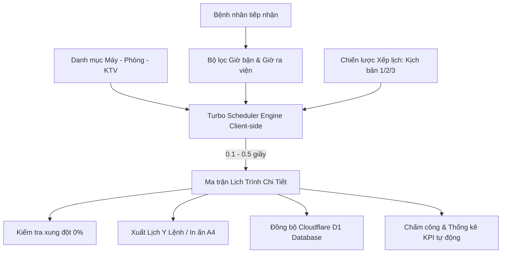
```mermaid
flowchart TD
    A[Bệnh nhân tiếp nhận] --> B[Bộ lọc Giờ bận & Giờ ra viện]
    C[Danh mục Máy - Phòng - KTV] --> D[Turbo Scheduler Engine Client-side]
    B --> D
    E[Chiến lược Xếp lịch: Kịch bản 1/2/3] --> D
    D -->|0.1 - 0.5 giây| F[Ma trận Lịch Trình Chi Tiết]
    F --> G[Kiểm tra xung đột 0%]
    F --> H[Xuất Lịch Y Lệnh / In ấn A4]
    F --> I[Đồng bộ Cloudflare D1 Database]
    F --> J[Chấm công & Thống kê KPI tự động]
```

### 1.2 Điểm Sáng Công Nghệ Phiên Bản V3 Cloudflare
- **Kiến trúc Edge Computing**: Chuyển đổi toàn diện từ Google Apps Script sang **Cloudflare Workers** kết hợp cơ sở dữ liệu **Cloudflare D1 (SQLite Edge)**, cho độ trễ phản hồi cực nhanh (10 - 25ms).
- **Bộ nhớ đệm Offline Cache (0ms)**: Hoạt động bền bỉ ngay cả khi mất kết nối Internet thông qua LocalStorage và Service Sync Engine.
- **Turbo Scheduler Engine**: Bộ thuật toán tối ưu hóa đa luồng xử lý 183+ ca thủ thuật chỉ trong **0.1 - 0.5 giây**.
- **Điều Khiển Thứ Tự Kép (Dual-Mode Reordering)**: Tích hợp tay kéo thả `☰` chuẩn SortableJS và bộ nút bấm dịch chuyển nhanh Lên `▲` / Xuống `▼` trên toàn bộ 5 bảng danh mục.

---

## CHƯƠNG 2: ĐĂNG NHẬP, BẢO MẬT & ĐIỀU HƯỚNG GIAO DIỆN

### 2.1 Màn Hình Đăng Nhập An Toàn
Khi truy cập hệ thống, giao diện đăng nhập Glassmorphism hiển thị ngay tại trung tâm:

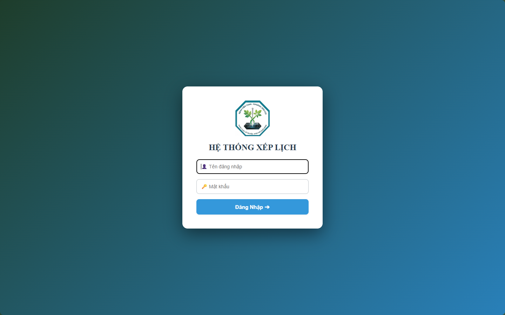

#### Các bước thực hiện:
1. Nhập **👤 Tên đăng nhập** (Ví dụ: `admin_yhct` hoặc tài khoản nhân viên được cấp).
2. Nhập **🔑 Mật khẩu** (Mật khẩu được mã hóa băm SHA-256 an toàn).
3. Nhấn phím **Enter** trên bàn phím hoặc nhấp nút **Đăng Nhập ➔**.
4. Hệ thống xác thực danh tính, nạp phiên làm việc (`meds_session`) và tự động tải bộ nhớ đệm D1 Database.

### 2.2 Thanh Tiện Ích Toàn Cục (Global Header)
Thanh Header cố định trên cùng cung cấp các thông tin và công cụ quan trọng:

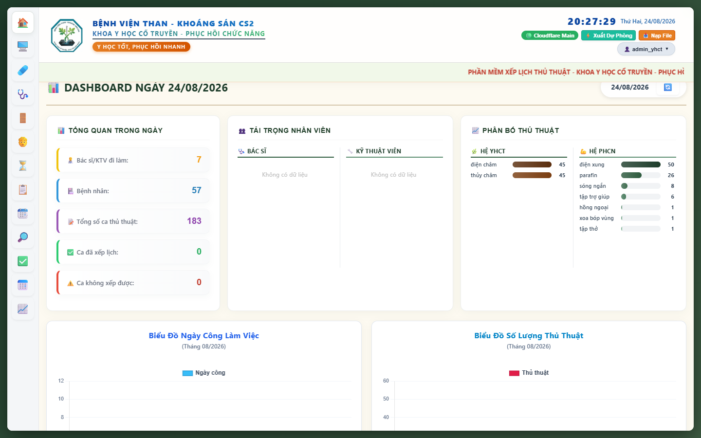

- **Logo Bệnh Viện & Slogan**: Bấm vào logo để quay trở về Trang Chủ tức thì.
- **Đồng hồ thời gian thực**: Hiển thị chính xác Giờ:Phút:Giây và Thứ, Ngày/Tháng/Năm.
- **Huy hiệu Máy Chủ (`🟢 Cloudflare Main`)**: Hiển thị trạng thái kết nối máy chủ Cloudflare D1. Bấm vào để mở menu chuyển đổi dự phòng khẩn cấp.
- **Nút ⚡️ Xuất Dự Phòng**: Xuất toàn bộ cơ sở dữ liệu hệ thống ra file `.json` chỉ với 1 click.
- **Nút 📥 Nạp File**: Nhập và khôi phục dữ liệu từ file backup `.json` khẩn cấp khi cần thiết.
- **Menu Người Dùng (`👤 admin_yhct ▼`)**:
  - Nhấp để mở menu quản trị nhanh: Chuyển đến phân hệ **🔒 Quản Trị** (dành cho Admin) hoặc **🚪 Đăng xuất**.
- **Dòng Chữ Chạy (Marquee)**: Truyền tải thông báo nội bộ, đường dây nóng hỗ trợ của khoa.

### 2.3 Thanh Điều Hướng Đa Phân Hệ (Sidebar)
Sidebar nằm bên trái giao diện, hỗ trợ thu gọn tự động (`collapsed-sidebar`) và mở rộng mượt mà khi rê chuột:
- **🏠 Trang Chủ**: Bảng điều khiển KPI ngày.
- **🗂️ Khối Danh Mục**: Máy Móc, Thủ Thuật, Nhân Sự, Phòng.
- **📥 Khối Tiếp Nhận**: Bệnh Nhân, Giờ Bận / Ra Viện.
- **🗓️ Khối Xếp Lịch**: Ngày Thường, Thứ 7.
- **🧰 Khối Tiện Ích**: Tìm Giờ Rảnh, Kiểm Tra Lỗi.
- **📊 Khối Báo Cáo**: Bảng Chấm Công, Thống Kê Tổng Hợp.

---

## CHƯƠNG 3: TRANG CHỦ & BẢNG ĐIỀU KHIỂN (DASHBOARD)

Trang Chủ cung cấp cái nhìn toàn cảnh về tình hình hoạt động của Khoa trong ngày:

### 3.1 Bộ Lọc Ngày & Thao Tác
- **Ô chọn ngày (Date Filter Flatpickr)**: Cho phép xem lại số liệu của bất kỳ ngày nào trong quá khứ hoặc tương lai.
- **Nút 🔄 Làm mới**: Đưa ngày xem về Hôm nay và làm mới dữ liệu từ Cloudflare D1.

### 3.2 Khối Chỉ Số Tổng Quan Trong Ngày
- **🩺 Bác sĩ / KTV đi làm**: Tổng số nhân sự trực tiếp làm việc theo lịch phân công.
- **🧑 Bệnh nhân**: Số lượng bệnh nhân đang điều trị cần xếp lịch.
- **📝 Tổng số ca thủ thuật**: Tổng số lượt kỹ thuật được chỉ định thực hiện trong ngày.
- **✅ Ca đã xếp lịch**: Số ca được thuật toán phân bổ thành công vào khung giờ.
- **⚠️ Ca không xếp được**: Cảnh báo số ca bị rớt lịch nếu quá tải máy/nhân sự.

### 3.3 Khối Tải Trọng & Phân Bố Thủ Thuật
- **Tải Trọng Nhân Viên**: Thống kê khối lượng công việc phân bổ cho từng Bác sĩ và Kỹ thuật viên.
- **Phân Bố Thủ Thuật**: Thống kê số lượng từng loại kỹ thuật theo 2 hệ:
  - 🌿 **Hệ YHCT**: Điện châm, Thủy châm, Xoa bóp bấm huyệt, Hào châm, Cấy chỉ...
  - 💪 **Hệ PHCN**: Điện xung, Parafin, Sóng ngắn, Tập trợ giúp, Hồng ngoại, Siêu âm, Kéo giãn, Tập thở...
- **Biểu Đồ Trực Quan (Chart.js)**: Biểu đồ cột thể hiện Ngày công làm việc và Biểu đồ số lượng thủ thuật theo từng tháng.

---

## CHƯƠNG 4: KHỐI QUẢN LÝ DANH MỤC HỆ THỐNG

Khối Danh mục là nền tảng cốt lõi định nghĩa toàn bộ tài nguyên vận hành của khoa.

---

### 4.1 Quản Lý Danh Mục Máy Móc
Quản lý danh sách 63+ thiết bị điều trị hiện có tại khoa.

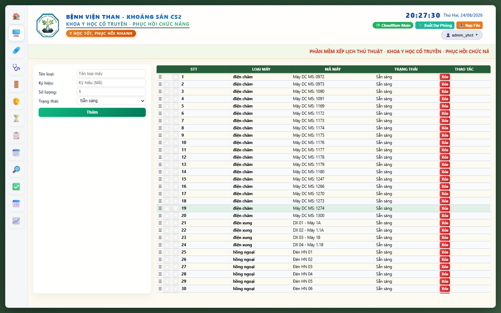

#### Các trường thông tin & Thao tác:
1. **Thêm máy mới (Khung bên trái)**:
   - **Tên loại máy**: Chọn hoặc nhập tên thiết bị (VD: `điện châm`, `điện xung`, `hồng ngoại`, `parafin`, `sóng ngắn`...).
   - **Ký hiệu (Mã máy)**: Nhập mã định danh duy nhất (VD: `Máy DC MS: 0972`, `DX 01 - Máy 1A`, `Đèn HN 01`...).
   - **Số lượng**: Số lượng máy cần thêm đồng loạt.
   - **Trạng thái**: Chọn `Sẵn sàng`, `Hỏng`, hoặc `Bảo trì`.
   - Bấm nút **Thêm** để lưu vào cơ sở dữ liệu.
2. **Sắp xếp thứ tự (Dual-Mode Reordering)**:
   - **Kéo thả `☰`**: Bấm giữ chuột hoặc ngón tay vào biểu tượng `☰` ở cột STT để kéo dòng đến vị trí mong muốn.
   - **Nút di chuyển nhanh `▲` / `▼`**: Bấm nút `▲` để đẩy máy lên trên 1 bậc; bấm nút `▼` để hạ máy xuống dưới 1 bậc (thời gian thực thi 0.01s).
   - Thứ tự mới được lưu tức thì vào `localStorage` và tự động đồng bộ về Cloudflare D1.
3. **Xóa máy**: Bấm nút **Xóa** màu đỏ ở cuối hàng để loại bỏ máy không còn sử dụng.

---

### 4.2 Quản Lý Danh Mục Thủ Thuật
Cấu hình chi tiết các quy chuẩn kỹ thuật cho từng thủ thuật điều trị.

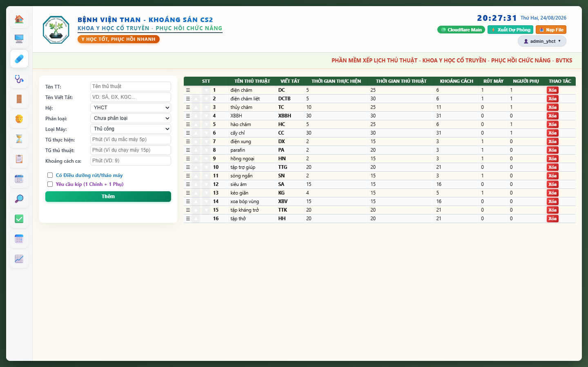

#### Chi tiết các thông số kỹ thuật:
- **Tên TT**: Tên đầy đủ của thủ thuật (VD: `điện châm`, `thủy châm`, `điện xung`, `parafin`, `sóng ngắn`...).
- **Tên Viết Tắt**: Mã viết tắt chuẩn để nhận diện nhanh trên y lệnh (VD: `DC`, `TC`, `DX`, `PA`, `SN`, `XBBH`, `TTG`, `KG`...).
- **Hệ**: Chọn `YHCT`, `PHCN` hoặc `Cả hai`.
- **Phân loại**: Phân loại mức độ kỹ thuật (`Loại 1`, `Loại 2`, `Loại 3`, `Khác`) phục vụ thống kê KPI và tính tiền công.
- **Loại Máy**: Chọn loại máy cần gắn cho thủ thuật hoặc để `Thủ công` (nếu không cần máy).
- **TG thực hiện (phút)**: Thời gian Bác sĩ/KTV trực tiếp thao tác trên bệnh nhân (VD: cắm kim, gắn điện cực, tiêm thuốc).
- **TG thủ thuật (phút)**: Tổng thời gian duy trì thủ thuật (bao gồm cả thời gian chạy máy lưu kim, ủ ấm...).
- **Khoảng cách ca (phút)**: Thời gian giãn cách nghỉ ngơi an toàn giữa 2 ca thủ thuật trên cùng một bệnh nhân.
- **Checkbox "Có Điều dưỡng rút/tháo máy"**: Cho phép Điều dưỡng tháo máy để giải phóng Bác sĩ/KTV chính làm ca tiếp theo.
- **Checkbox "Yêu cầu kíp (1 Chính + 1 Phụ)"**: Đòi hỏi bố trí cả Nhân viên chính và Nhân viên phụ cùng thực hiện.

---

### 4.3 Quản Lý Danh Mục Nhân Sự
Quản lý hồ sơ, phân quyền chuyên môn và lịch làm việc của đội ngũ Bác sĩ, Kỹ thuật viên, Điều dưỡng.

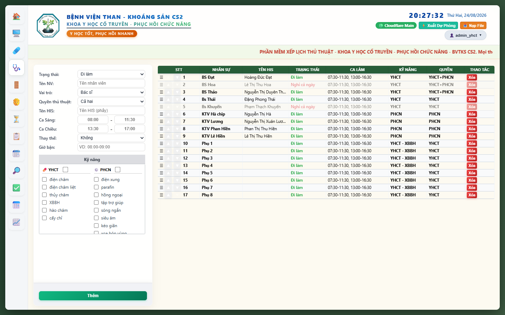

#### Các tính năng chính:
- **Trạng thái làm việc**: `Đi làm`, `Nghỉ phép`, `Đi học`, `Nghỉ cả ngày`.
- **Tên NV & Vai trò**: Bác sĩ (BS), Kỹ thuật viên (KTV), Điều dưỡng (ĐD), Phụ tá.
- **Quyền thủ thuật**: Chọn phạm vi chuyên môn được phép thực hiện (`YHCT`, `PHCN`, `Cả hai`).
- **Tên HIS**: Tên nhân viên tương ứng trên phần mềm bệnh viện phục vụ việc đồng bộ dữ liệu.
- **Ca làm việc**: Khung giờ ca Sáng (07:30 - 11:30) và Ca Chiều (13:00 - 16:30).
- **Kỹ Năng Thực Hiện**: Tích chọn danh sách các thủ thuật cụ thể mà nhân viên này đã được đào tạo và cấp chứng chỉ hành nghề.
- **Điều chỉnh thứ tự**: Kéo thả `☰` hoặc bấm nút `▲`/`▼` để ưu tiên nhân sự khi thuật toán phân bổ ca.

---

### 4.4 Quản Lý Danh Mục Phòng
Định nghĩa không gian làm việc và phân bổ trang thiết bị cho từng phòng chức năng.

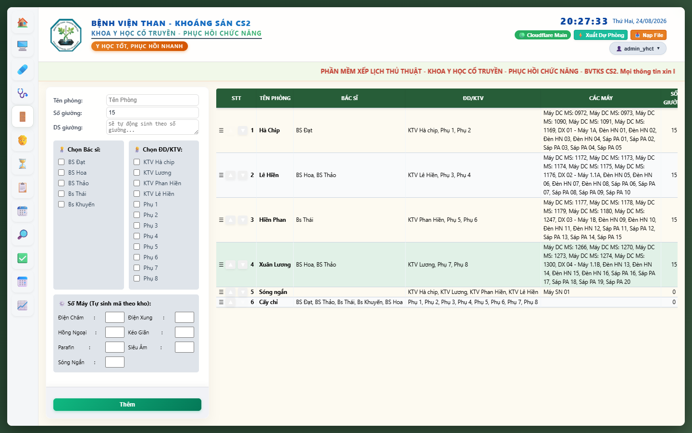

- **Tên Phòng**: Tên phòng điều trị (VD: `Phòng Hà Chip`, `Phòng Lê Hiền`, `Phòng Hiền Phan`, `Phòng Xuân Lương`...).
- **Bác sĩ phụ trách & KTV phụ trách**: Chỉ định nhân sự thường trực tại phòng.
- **Danh sách máy**: Khai báo các loại máy móc đặt cố định trong phòng.
- **Số giường & Danh sách giường**: Khai báo số giường và ký hiệu giường (G1, G2, G3, G4...).

---

## CHƯƠNG 5: KHỐI TIẾP NHẬN & QUẢN LÝ BỆNH NHÂN

---

### 5.1 Tiếp Nhận & Quản Lý Bệnh Nhân
Nơi tiếp nhận thông tin bệnh nhân hàng ngày, nhập chỉ định điều trị và theo dõi trạng thái xếp lịch.

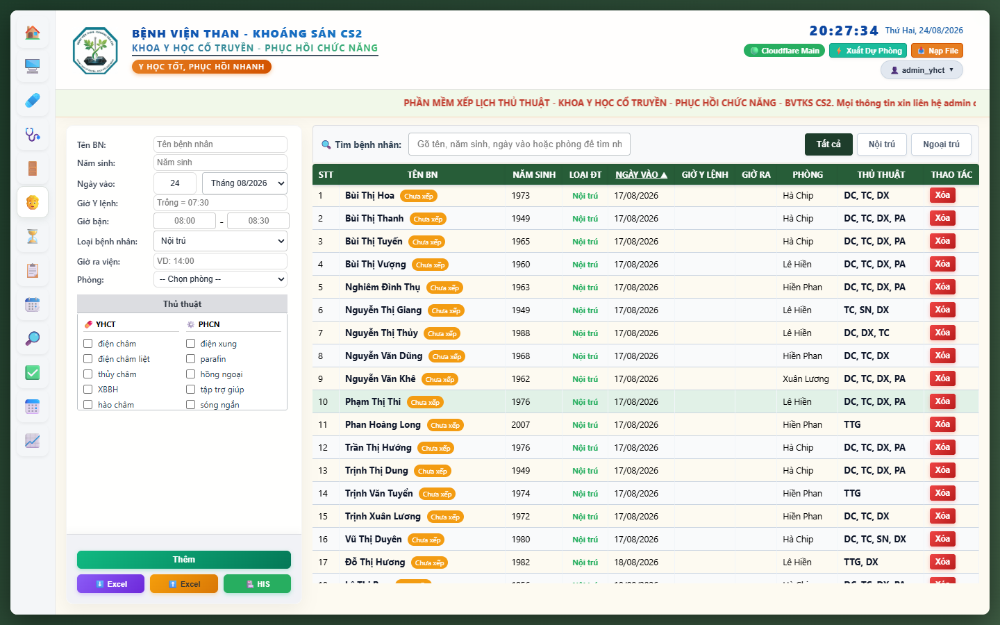

#### Quy trình tiếp nhận bệnh nhân:
1. **Nhập thông tin bệnh nhân (Khung bên trái)**:
   - **Tên BN**: Nhập họ tên đầy đủ (VD: `Nguyễn Văn A`).
   - **Năm sinh**: Nhập năm sinh (VD: `1965`).
   - **Ngày vào**: Chọn ngày nhập viện điều trị (tự động gợi ý bằng Flatpickr).
   - **Giờ Y lệnh**: Giờ bệnh nhân bắt đầu có thể thực hiện thủ thuật (mặc định: `07:30`).
   - **Giờ bận**: Khoảng thời gian bệnh nhân bận việc riêng (VD: đi siêu âm, truyền dịch từ `08:00 - 08:30`).
   - **Loại bệnh nhân**: Chọn `Nội trú` hoặc `Ngoại trú`.
   - **Giờ ra viện**: Giờ bệnh nhân xuất viện trong ngày (VD: `14:00`).
   - **Phòng**: Chỉ định phòng điều trị cho bệnh nhân.
2. **Chọn nhanh thủ thuật**:
   - Tích chọn trực tiếp các ô checkbox trong 2 bảng **Hệ YHCT** và **Hệ PHCN**.
   - Bấm nút **Thêm** màu xanh lá. Bệnh nhân sẽ xuất hiện ngay lập tức trong bảng danh sách bên phải.
3. **Các tính năng tiện ích mở rộng**:
   - **Nút ⬇ Excel (Nhập)**: Nhập khẩu danh sách bệnh nhân hàng loạt từ file Excel.
   - **Nút ⬆ Excel (Xuất)**: Xuất danh sách bệnh nhân hiện tại ra file Excel để lưu trữ.
   - **Nút 🏥 HIS**: Tự động đồng bộ danh sách bệnh nhân từ phần mềm bệnh viện HIS.
   - **Bộ lọc danh sách**: Nút **Tất cả**, **Nội trú**, **Ngoại trú** giúp lọc nhanh danh sách bệnh nhân.
   - **Sắp xếp theo Ngày Vào**: Bấm vào tiêu đề cột **"NGÀY VÀO ▲"** để đảo chiều sắp xếp tăng/giảm linh hoạt.
   - **Tìm kiếm thời gian thực**: Gõ tên, năm sinh hoặc phòng vào ô tìm kiếm để lọc kết quả tức thì.

---

### 5.2 Quản Lý Giờ Bận / Ra Viện
Quản lý các trường hợp đặc biệt về thời gian của cả nhân viên và bệnh nhân.

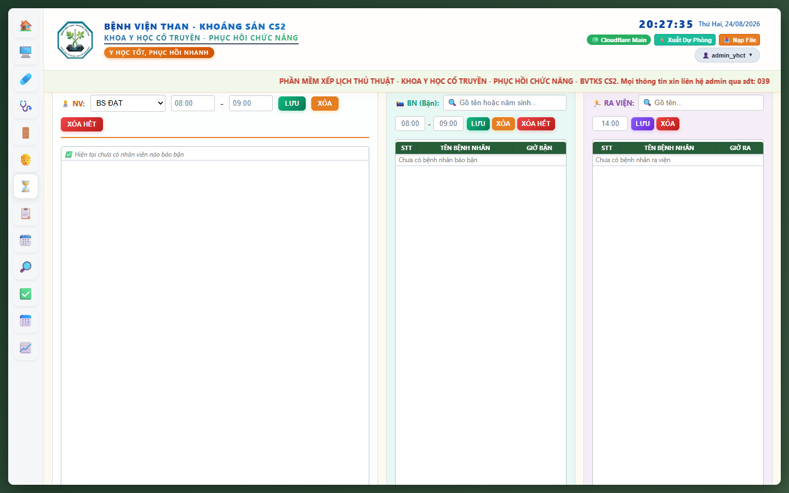

Giao diện chia làm 3 cột rõ ràng:
1. 🧑‍⚕️ **Cột 1 - Nhân Viên Báo Bận**:
   - Chọn tên Nhân viên (NV) -> Nhập khung giờ bận (VD: `08:00 - 09:00`) -> Bấm **LƯU**.
   - Nút **XÓA HẾT**: Xóa nhanh toàn bộ giờ bận của nhân viên trong ngày.
2. 🧑 **Cột 2 - Bệnh Nhân Báo Bận**:
   - Gõ tìm tên bệnh nhân -> Nhập khung giờ bận -> Bấm **LƯU**.
   - Thuật toán sẽ không bao giờ xếp thủ thuật của bệnh nhân này vào khung giờ đã báo bận.
3. 🏃 **Cột 3 - Bệnh Nhân Ra Viện**:
   - Gõ tìm tên bệnh nhân -> Nhập giờ ra viện (VD: `14:00`) -> Bấm **LƯU**.
   - Toàn bộ thủ thuật của bệnh nhân sau giờ ra viện sẽ được dồn lên trước hoặc loại bỏ hợp lý.

---

## CHƯƠNG 6: PHÂN HỆ XẾP LỊCH TỰ ĐỘNG NGÀY THƯỜNG (CORE ENGINE)

Đây là phân hệ trung tâm và mạnh mẽ nhất của phần mềm.

---

### 6.1 Quy Trình Xếp Lịch Tổng & Chọn Chiến Lược
Khi vào tab **📋 Ngày Thường**, bấm nút **CHẠY XẾP LỊCH TỔNG**, màn hình sẽ mở hộp thoại **🎯 CHỌN CHIẾN LƯỢC XẾP LỊCH**:

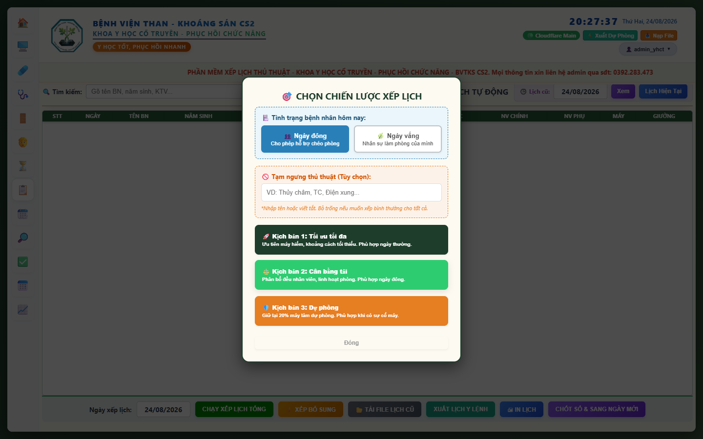

#### Các thiết lập chiến lược:
1. **Tình trạng bệnh nhân hôm nay**:
   - 👥 **Ngày đông**: Cho phép nhân sự hỗ trợ chéo giữa các phòng khi phòng bên cạnh quá tải.
   - 🌾 **Ngày vắng**: Nhân sự tập trung làm đúng phòng được phân công.
2. **Tạm ngưng thủ thuật (Tùy chọn)**:
   - Nhập tên hoặc mã viết tắt các thủ thuật muốn tạm dừng hôm nay (VD: hết thuốc Thủy châm, máy Sóng ngắn bảo trì...).
3. **Lựa chọn 1 trong 3 Kịch Bản Vận Hành**:
   - 🚀 **Kịch bản 1: Tối ưu tối đa** *(Khuyến nghị ngày thường)*: Ưu tiên thiết bị hiếm, khoảng cách giữa các ca ngắn nhất, hoàn thành ca điều trị sớm nhất.
   - ⚖️ **Kịch bản 2: Cân bằng tải** *(Khuyến nghị ngày đông)*: Phân bổ đều khối lượng ca cho tất cả nhân viên, giảm áp lực làm việc liên tục.
   - 🛡️ **Kịch bản 3: Dự phòng** *(Khi có máy hỏng)*: Giữ lại 20% công suất máy làm dự phòng tránh gián đoạn điều trị.

Sau khi chọn kịch bản, **Turbo Scheduler Engine** sẽ tính toán ma trận lịch trình trong **0.1 - 0.5 giây** và hiển thị thông báo kết quả:

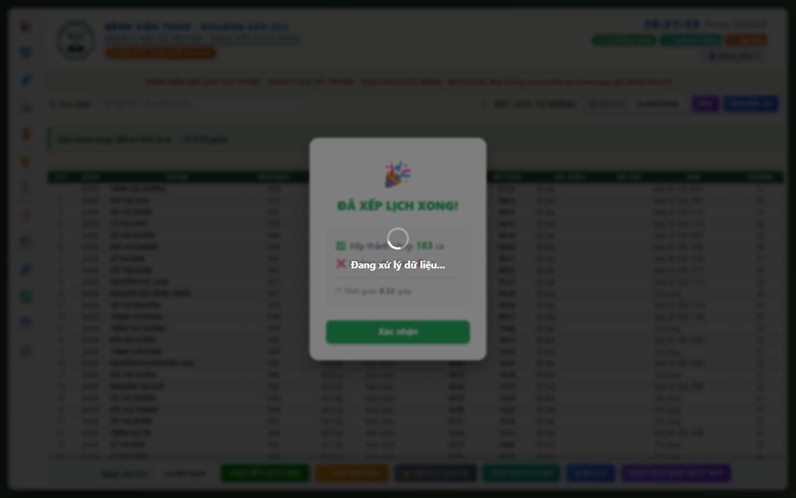

---

### 6.2 Ma Trận Lịch Trình Chi Tiết & Thao Tác
Sau khi bấm **Xác nhận**, toàn bộ bảng lịch trình chi tiết hiển thị trực quan:

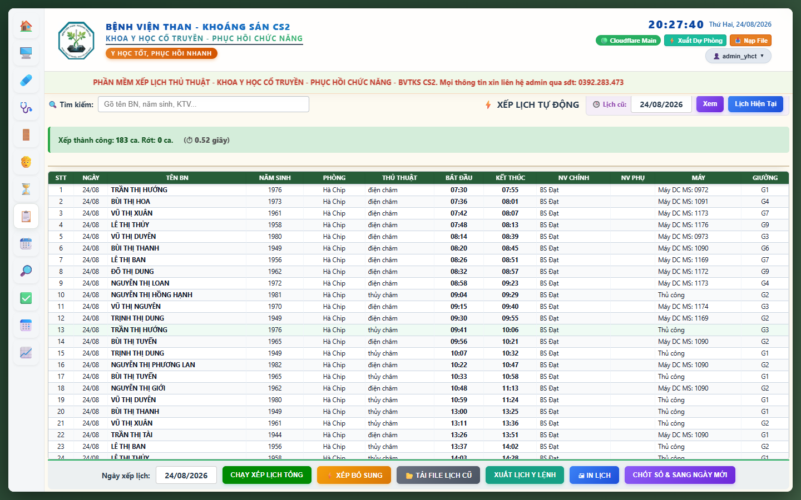

#### Ý nghĩa các cột trong bảng:
| Cột | Ý nghĩa | Chi tiết hiển thị |
| :--- | :--- | :--- |
| **STT** | Số thứ tự ca | 1, 2, 3... |
| **NGÀY** | Ngày thực hiện | Ngày/Tháng (VD: 24/08) |
| **TÊN BN** | Tên bệnh nhân | Viết hoa rõ ràng (VD: TRẦN THỊ HƯỚNG) |
| **NĂM SINH** | Năm sinh bệnh nhân | 1976, 1961... |
| **PHÒNG** | Phòng thực hiện | Hà Chip, Lê Hiền, Hiền Phan... |
| **THỦ THUẬT** | Tên kỹ thuật | điện châm, thủy châm, điện xung, parafin... |
| **BẮT ĐẦU** | Giờ bắt đầu ca | 07:30, 08:14... |
| **KẾT THÚC** | Giờ kết thúc ca | 07:55, 08:39... |
| **NV CHÍNH** | Bác sĩ / KTV chính | BS Đạt, KTV Hà, KTV Lương... |
| **NV PHỤ** | Nhân viên hỗ trợ | Hiển thị nếu thủ thuật yêu cầu kíp |
| **MÁY** | Thiết bị sử dụng | Máy DC MS: 0972, Thủ công... |
| **GIƯỜNG** | Giường bệnh | G1, G2, G3, G4... |

---

### 6.3 Các Chức Năng Bổ Trợ Xếp Lịch
- 🔍 **Tìm kiếm lịch trình**: Gõ tên bệnh nhân, năm sinh, tên KTV hoặc tên máy vào ô tìm kiếm để lọc nhanh các ca liên quan.
- 🕒 **Xem Lịch Cũ**: Chọn ngày trong quá khứ tại ô **Lịch cũ** và bấm **Xem** để tra cứu lịch sử điều trị; bấm **Lịch Hiện Tại** để quay về.
- ⚡ **Nút XẾP BỔ SUNG**: Khi có bệnh nhân mới phát sinh trong ngày, bấm nút này để xếp chèn vào các khung giờ rảnh còn trống mà không làm xáo trộn các ca đã xếp trước đó.
- 📂 **Nút TẢI FILE LỊCH CŨ**: Nạp file dữ liệu lịch để khôi phục hoặc chỉnh sửa thủ công.
- 📤 **Nút XUẤT LỊCH Y LỆNH**: Xuất toàn bộ bảng lịch sang file Excel chuẩn định dạng y lệnh của Bệnh viện.
- 🖨 **Nút IN LỊCH**: Xuất bản in đẹp mắt tối ưu cho máy in khổ A4/A3 hoặc phiếu in lịch cho từng phòng.
- 🟣 **Nút CHỐT SỔ & SANG NGÀY MỚI**: Lưu trữ toàn bộ lịch trình ngày hôm nay vào cơ sở dữ liệu `lich_su`, tự động cập nhật ngày tiếp theo và dọn dẹp các bệnh nhân đã ra viện.

---

## CHƯƠNG 7: PHÂN HỆ XẾP LỊCH THỨ 7

Lịch làm việc ngày Thứ 7 có tính chất đặc thù: thời gian làm việc rút gọn (chỉ làm ca sáng), số lượng nhân viên trực ít hơn và bệnh nhân có khung giờ sẵn sàng khác nhau.

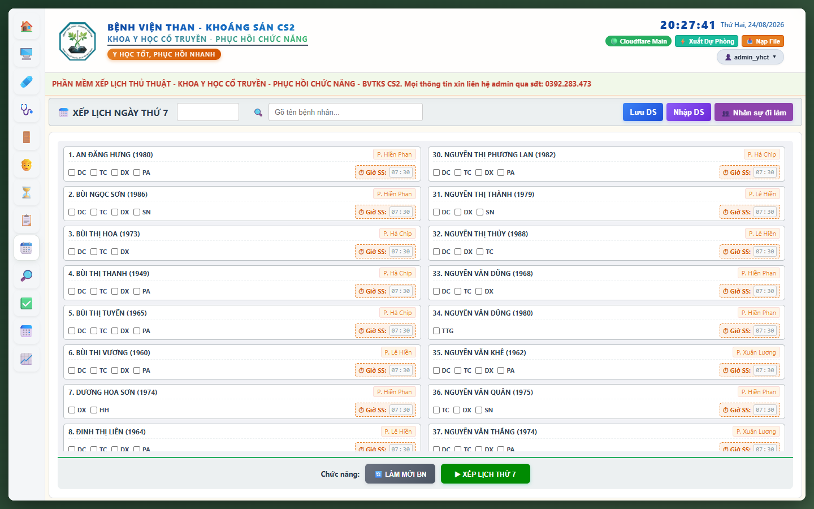

### 7.1 Quy Trình Xếp Lịch Thứ 7:
1. **Thiết lập danh sách bệnh nhân Thứ 7**:
   - Danh sách hiển thị dưới dạng các thẻ bệnh nhân (Card View).
   - Tích chọn lại các thủ thuật bệnh nhân sẽ làm vào Thứ 7 (DC, TC, DX, PA, SN, TTG, HH...).
   - Nhập **Giờ sẵn sàng (Giờ SS)** cho từng bệnh nhân (VD: bệnh nhân đến lúc `07:30` hoặc `08:00`).
2. **Khai báo nhân sự trực**:
   - Bấm nút **👥 Nhân sự đi làm** để chọn danh sách các Bác sĩ, KTV trực ca Thứ 7.
3. **Thao tác dữ liệu**:
   - Bấm **Lưu DS**: Lưu danh sách bệnh nhân Thứ 7 vào hệ thống.
   - Bấm **Nhập DS**: Nhập danh sách từ nguồn dữ liệu lưu trữ.
   - Bấm **🔄 LÀM MỚI BN**: Cập nhật lại toàn bộ danh sách bệnh nhân từ tiếp nhận.
4. **Chạy Xếp Lịch**:
   - Bấm nút **▶ XẾP LỊCH THỨ 7** màu xanh lá để thuật toán tiến hành phân bổ lịch chuyên biệt cho ngày Thứ 7.

---

## CHƯƠNG 8: CÁC TIỆN ÍCH KIỂM SOÁT & TRA CỨU THÔNG MINH

---

### 8.1 Tiện Ích Kiểm Tra Lỗi & Xung Đột Lịch
Công cụ đắc lực giúp kiểm tra tính toàn vẹn và hợp lệ tuyệt đối của bảng lịch.

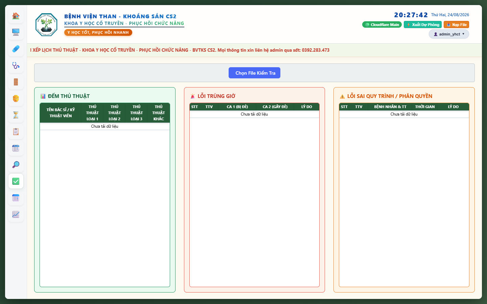

#### 3 Bảng Kiểm Tra Tự Động:
1. 📊 **Bảng 1 - Đếm Thủ Thuật**:
   - Tự động thống kê số lượng thủ thuật thực hiện trong ngày của từng Bác sĩ / KTV phân bổ theo `Loại 1`, `Loại 2`, `Loại 3` và `Khác`.
2. 🚨 **Bảng 2 - Lỗi Trùng Giờ**:
   - Quét toàn bộ các ca trong ngày. Nếu phát hiện bất kỳ trường hợp nào bị đè giờ, trùng máy hoặc trùng giường, hệ thống sẽ cảnh báo đỏ chính xác tên bệnh nhân, thời gian và nguyên nhân.
3. ⚠️ **Bảng 3 - Lỗi Sai Quy Trình / Phân Quyền**:
   - Cảnh báo nếu có sự vi phạm về phân quyền chuyên môn (VD: KTV chỉ có chứng chỉ PHCN nhưng lại được phân công làm thủ thuật YHCT).

---

### 8.2 Tiện Ích Tìm Khung Giờ Rảnh
Hỗ trợ nhân viên y tế tìm ngay khung giờ trống để nhận thêm bệnh nhân mới hoặc thực hiện ca phát sinh đột xuất.

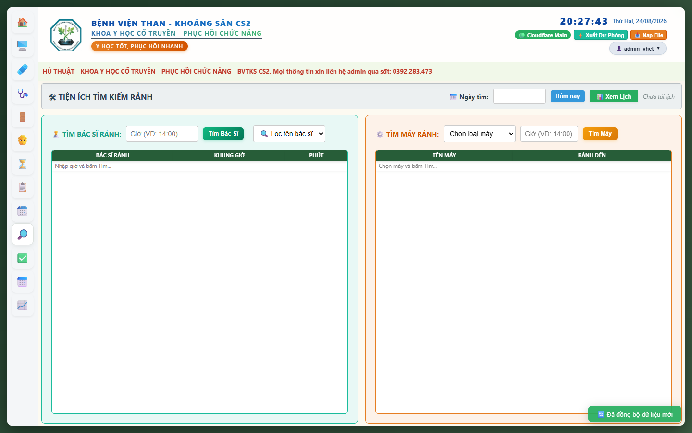

#### 2 Chức Năng Tra Cứu Song Song:
- 🧑‍⚕️ **Khung bên trái - Tìm Bác Sĩ / KTV Rảnh**:
  - Nhập mốc giờ cần tìm (VD: `14:00`) và/hoặc chọn Bác sĩ cụ thể -> Bấm **Tìm Bác Sĩ**.
  - Kết quả trả về danh sách các Bác sĩ đang rảnh, khung giờ rảnh cụ thể và tổng số phút rảnh liên tục.
- 🖥️ **Khung bên phải - Tìm Máy Rảnh**:
  - Chọn Loại máy (VD: `điện xung`, `sóng ngắn`, `parafin`...) và mốc giờ -> Bấm **Tìm Máy**.
  - Kết quả trả về danh sách mã máy đang trống và thời gian rảnh đến mấy giờ.

---

## CHƯƠNG 9: KHỐI BÁO CÁO, CHẤM CÔNG & THỐNG KÊ TỔNG HỢP

---

### 9.1 Bảng Chấm Công Điện Tử
Quản lý ngày công làm việc hàng tháng của toàn bộ đội ngũ nhân sự trong khoa.

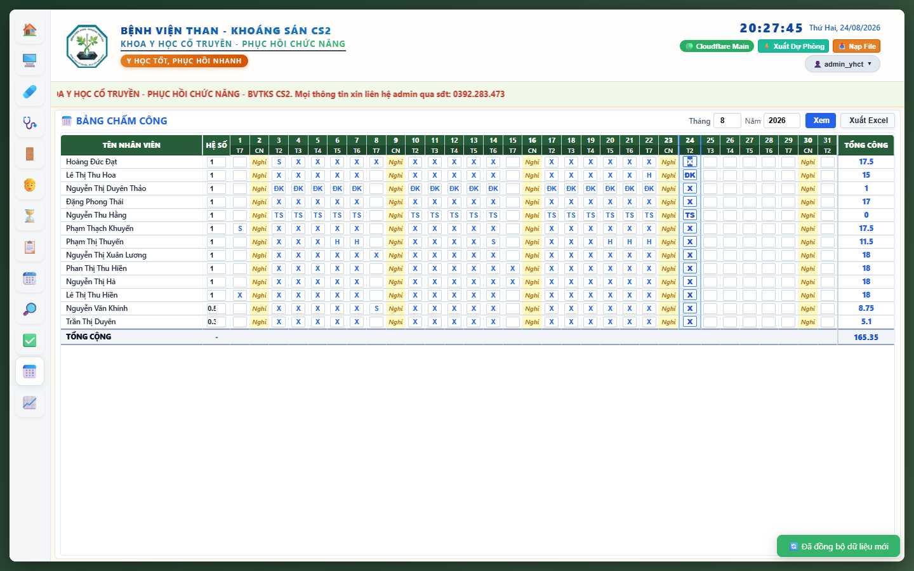

#### Hướng dẫn sử dụng:
1. **Xem và chọn tháng**: Nhập số **Tháng** (VD: `8`) và **Năm** (VD: `2026`) -> Bấm **Xem**.
2. **Quy ước các ký hiệu chấm công**:
   - `X`: Đi làm cả ngày (Tính 1 công).
   - `S`: Đi làm ca sáng (Tính 0.5 công).
   - `C`: Đi làm ca chiều (Tính 0.5 công).
   - `TS`: Nghỉ thai sản / chế độ.
   - `ĐK`: Đi khám bệnh / học tập ngắn hạn.
   - `H`: Đi học dài hạn.
   - `Nghi`: Ngày nghỉ cuối tuần / Nghỉ phép.
3. **Chỉnh sửa & Tính công**:
   - Người quản lý có thể nhấp chuột trực tiếp vào từng ô để sửa ký hiệu công.
   - Cột **TỔNG CÔNG** và hàng **TỔNG CỘNG** tự động tính toán lại theo Hệ số công của từng nhân viên.
4. **Đồng bộ & Xuất file**:
   - Dữ liệu tự động lưu và đồng bộ lên Cloudflare D1 (Huy hiệu **🔄 Đã đồng bộ dữ liệu mới** màu xanh góc phải).
   - Bấm **Xuất Excel** để tải bảng chấm công định dạng Excel chuẩn phòng tổ chức cán bộ.

---

### 9.2 Thống Kê Tổng Hợp & Phân Tích KPI
Phân tích chi tiết sản lượng thủ thuật, hiệu suất nhân viên và tính tiền công thực lĩnh.

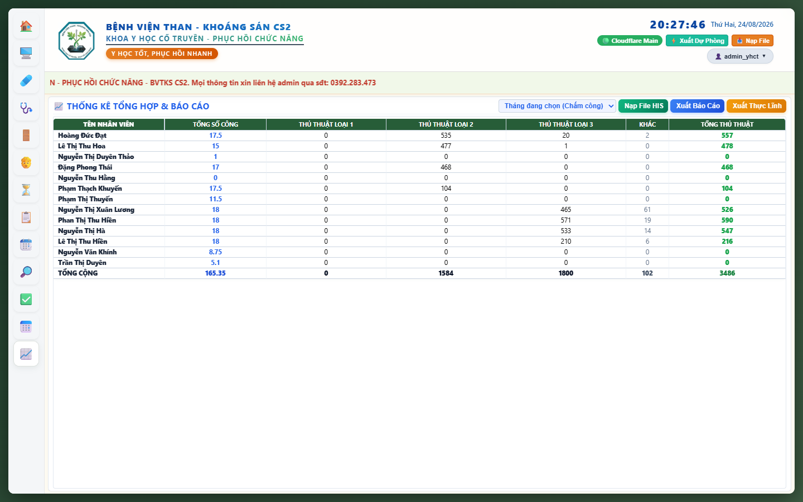

#### Các tính năng chính:
- **Liên kết dữ liệu chấm công**: Chọn tháng thống kê khớp với bảng chấm công.
- **Bảng số liệu chi tiết**:
  - Tên nhân viên.
  - Tổng số công trong tháng.
  - Số ca thủ thuật Loại 1, Loại 2, Loại 3 và Khác.
  - Tổng số thủ thuật thực hiện trong tháng.
- **Nạp File HIS**: Nhập khẩu dữ liệu thống kê từ phần mềm quản lý bệnh viện HIS.
- **Nút Xuất Báo Cáo**: Xuất báo cáo tổng hợp chi tiết theo biểu mẫu bệnh viện.
- **Nút Xuất Thực Lĩnh**: Tự động tính toán số tiền phụ cấp thủ thuật và tiền công thực lĩnh của từng cán bộ nhân viên theo quy chế nội bộ của khoa.

---

## CHƯƠNG 10: PHÂN HỆ QUẢN TRỊ HỆ THỐNG (ADMINISTRATION)

> [!IMPORTANT]
> Phân hệ Quản Trị chỉ dành riêng cho Quản trị viên hệ thống (Admin). Để truy cập, nhấp vào tên tài khoản trên Header -> chọn **🔒 Quản Trị**.

---

### 10.1 Cài Đặt Hệ Thống & Trọng Số Thuật Toán
Cấu hình các tham số vận hành cốt lõi của phần mềm:

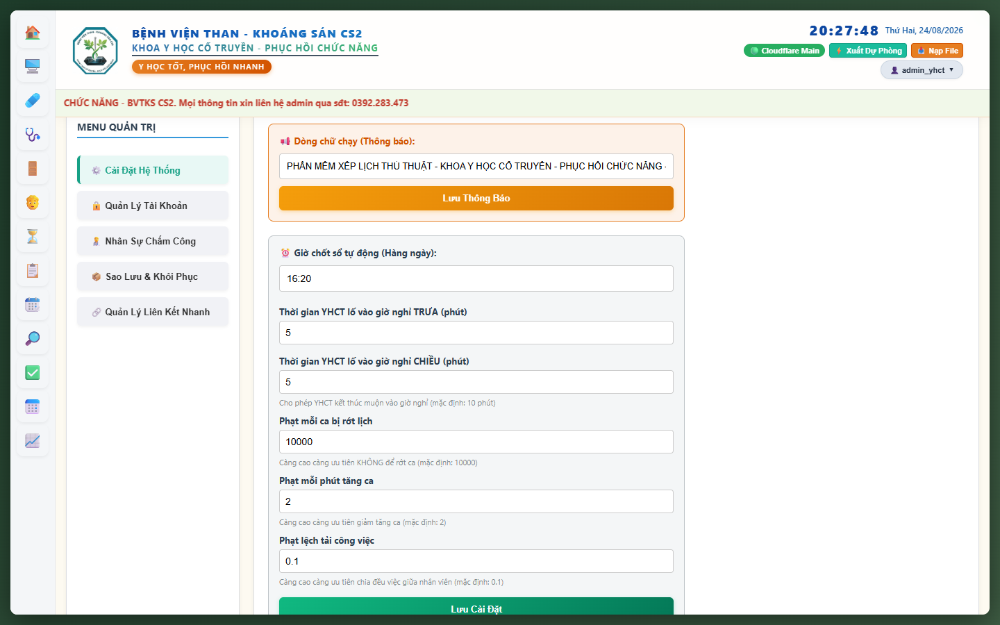

- **Dòng chữ chạy (Thông báo)**: Nhập thông điệp cần hiển thị trên thanh Marquee toàn viện -> Bấm **Lưu Thông Báo**.
- **Giờ chốt sổ tự động**: Mặc định `16:20` hàng ngày.
- **Thời gian YHCT lố vào giờ nghỉ TRƯA / CHIỀU**: Cho phép các ca YHCT (châm cứu) được kết thúc muộn hơn giờ nghỉ bao nhiêu phút (mặc định: `5` phút).
- **Trọng số phạt thuật toán**:
  - *Phạt mỗi ca bị rớt lịch*: Mặc định `10000` (ưu tiên tối đa không để rớt ca của bệnh nhân).
  - *Phạt mỗi phút tăng ca*: Mặc định `2` (hạn chế tối đa việc nhân viên phải làm ngoài giờ).
  - *Phạt lệch tải công việc*: Mặc định `0.1` (chia đều khối lượng công việc giữa các nhân viên).
- Bấm **Lưu Cài Đặt** để áp dụng thay đổi ngay lập tức.

---

### 10.2 Quản Lý Tài Khoản & Phân Quyền Chi Tiết
Quản lý danh sách người dùng và phân quyền truy cập từng tab theo chức năng nhiệm vụ:

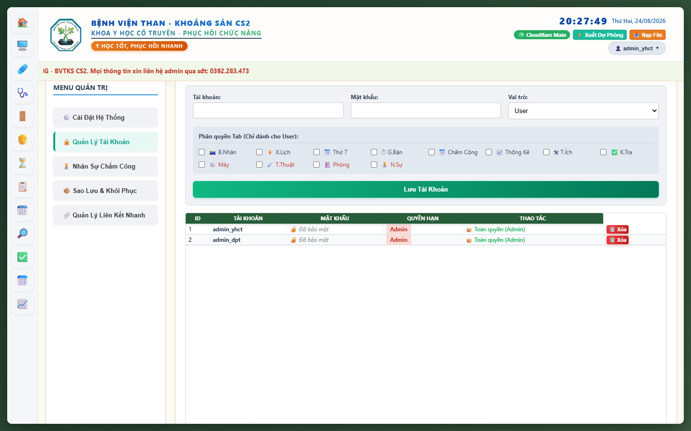

#### Cách tạo & phân quyền tài khoản mới:
1. Nhập **Tài khoản** (VD: `ktv_ha`).
2. Nhập **Mật khẩu** khởi tạo.
3. Chọn **Vai trò**: `User` hoặc `Admin`.
4. **Phân quyền Tab (Dành cho User)**: Tích chọn các tab được phép xem/sửa (Bệnh nhân, Xếp lịch, Thứ 7, Giờ bận, Chấm công, Thống kê, Tiện ích, Kiểm tra, Máy, Thủ thuật, Phòng, Nhân sự).
5. Bấm nút **Lưu Tài Khoản**.
6. Danh sách tài khoản hiển thị ở bảng bên dưới kèm mật khẩu bảo mật và nút **Xóa**.

---

### 10.3 Sao Lưu, Khôi Phục & Đồng Bộ Đám Mây
Bảo vệ dữ liệu an toàn đa tầng, chống mất mát thông tin:

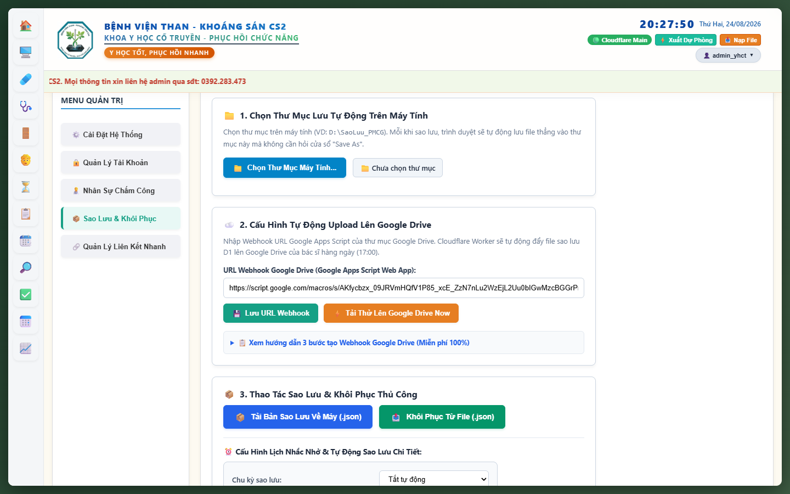

1. 📁 **1. Chọn Thư Mục Lưu Tự Động Trên Máy Tính**:
   - Bấm **Chọn Thư Mục Máy Tính...** để chọn thư mục lưu trữ cục bộ (VD: `D:\SaoLuu_PMCG`). Mỗi khi sao lưu, file sẽ tự động tải vào đây mà không cần xác nhận "Save As".
2. ☁️ **2. Cấu Hình Tự Động Upload Lên Google Drive**:
   - Nhập Webhook URL Google Apps Script liên kết với Google Drive của Khoa.
   - Cloudflare Worker sẽ tự động đóng gói dữ liệu D1 và đẩy file backup lên Google Drive vào lúc **17:00 hàng ngày**.
   - Bấm **Tải Thử Lên Google Drive Now** để kiểm tra kết nối.
3. 📦 **3. Thao Tác Sao Lưu & Khôi Phục Thủ Công**:
   - **Nút Tải Bản Sao Lưu Về Máy (.json)**: Tải file sao lưu dữ liệu toàn diện về máy tính.
   - **Nút Khôi Phục Từ File (.json)**: Chọn file `.json` đã lưu để khôi phục lại toàn bộ dữ liệu trong trường hợp thay đổi máy tính hoặc gặp sự cố.

---

## CHƯƠNG 11: QUY TRÌNH XỬ LÝ SỰ CỐ & SAO LƯU DỰ PHÒNG KHẨN CẤP

Hệ thống được trang bị cơ chế tự phục hồi và sao lưu dự phòng đa tầng (Disaster Recovery):

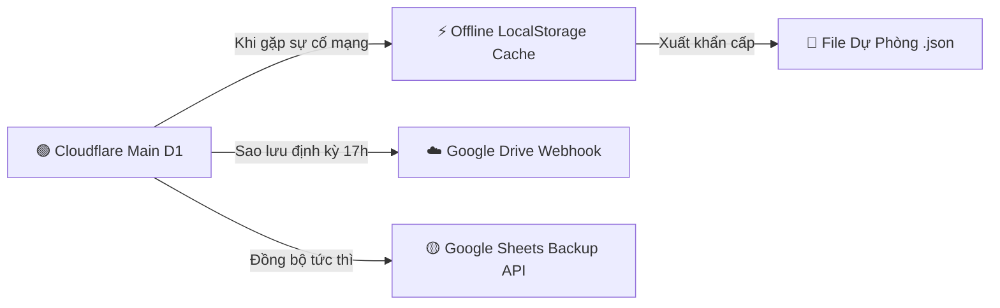
```mermaid
graph LR
    CF[🟢 Cloudflare Main D1] -->|Khi gặp sự cố mạng| LS[⚡ Offline LocalStorage Cache]
    CF -->|Sao lưu định kỳ 17h| GD[☁️ Google Drive Webhook]
    CF -->|Đồng bộ tức thì| GS[🟡 Google Sheets Backup API]
    LS -->|Xuất khẩn cấp| JSON[📄 File Dự Phòng .json]
```

### 11.1 Khi Mất Mạng Internet Hoặc Máy Chủ Cloudflare Bảo Trì
- Phần mềm tự động chuyển sang chế độ **Offline First (0ms)**.
- Toàn bộ dữ liệu Bệnh nhân, Danh mục, Bảng chấm công và Lịch trình vẫn được lưu trong bộ nhớ máy tính (`localStorage`).
- Người dùng vẫn thực hiện Xếp lịch, Thống kê, In ấn và Chấm công bình thường.

### 11.2 Menu Chuyển Đổi Máy Chủ Khẩn Cấp
Bấm trực tiếp vào huy hiệu `🟢 Cloudflare Main` trên Header để mở menu khẩn cấp:
- **Nhập 1**: Kết nối lại máy chủ chính Cloudflare Main.
- **Nhập 2**: Xuất nhanh file sao lưu khẩn cấp `.json`.
- **Nhập 3**: Nhập URL Google Apps Script WebApp dự phòng.
- **Nhập 4**: 🔄 Kích hoạt đồng bộ toàn bộ cơ sở dữ liệu D1 sang Google Sheets ngay lập tức.

---

## CHƯƠNG 12: BẢNG PHÍM TẮT & MẸO VẬN HÀNH TỐI ƯU

| Thao tác | Phím tắt / Mẹo thực hiện | Hiệu quả |
| :--- | :--- | :--- |
| **Đăng nhập nhanh** | Nhập mật khẩu rồi bấm phím `Enter` | Đăng nhập tức thì |
| **Về Trang Chủ** | Bấm vào Logo Bệnh viện trên Header | Về Dashboard ngay |
| **Sắp xếp dòng bảng** | Bấm giữ biểu tượng `☰` hoặc bấm nút `▲` / `▼` | Đổi thứ tự trong 0.01 giây |
| **Đổi chiều ngày vào BN** | Bấm vào tiêu đề cột `"NGÀY VÀO ▲"` | Sắp xếp BN mới/cũ |
| **Tìm kiếm nhanh** | Gõ từ khóa vào ô `"🔍 Tìm kiếm"` ở bất kỳ tab nào | Lọc kết quả thời gian thực |
| **Chạy xếp lịch Turbo** | Bấm `"CHẠY XẾP LỊCH TỔNG"` -> Chọn Kịch bản 1 | Xếp 180+ ca trong 0.3s |
| **Xếp ca đến muộn** | Bấm `"⚡ XẾP BỔ SUNG"` | Chèn ca mới, giữ nguyên lịch cũ |
| **Sao lưu nhanh** | Bấm nút `"⚡️ Xuất Dự Phòng"` trên Header | Tải file `.json` trong 1 giây |
| **Đồng bộ bảng chấm công** | Sửa trực tiếp ô chấm công -> Tự động lưu D1 | 0 thao tác bấm lưu |

---

> 💡 **HỖ TRỢ KỸ THUẬT & QUẢN TRỊ VIÊN:**  
> - **Khoa Y Học Cổ Truyền - Phục Hồi Chức Năng** | Bệnh Viện Than - Khoáng Sản Cơ Sở 2  
> - **Hotline Quản trị viên (Admin):** 0392.283.473  
> - **Hệ thống Web:** [https://xeplichthuthuat.io.vn/](https://xeplichthuthuat.io.vn/)  
> - **Bản quyền © 2026 T.I.M.E.S. System. All rights reserved.**
